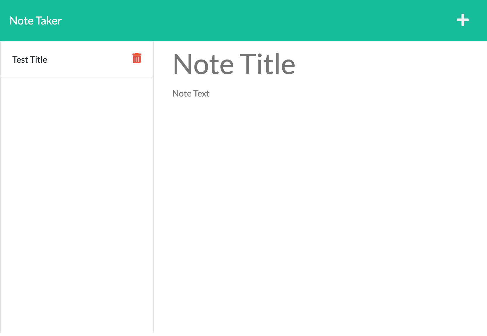

# Express.js Note Taker

[](https://opensource.org/licenses/MIT)

## Description

This application can be used to write and save notes. This application uses an Express.js back end and saves and retrieves note data from a JSON file named `db.json`.

## Table of Contents

- [Installation](#installation)
- [Usage](#usage)
- [License](#license)
- [Tests](#tests)
- [Credits](#credits)
- [Questions](#questions)

## Installation

To install, please ensure you have `node.js` installed on your computer. Then clone the git repo and run `npm i` to install all dependencies.

[Click Here for GitHub Repo](https://github.com/naveed-mahmoudian/Express-Note-Taker)

## Usage

To use this application you can run `npn run watch` to start the server. The default port is set to `3001`. To change the port, adjust the `PORT` variable at the top of the `server.js` file.



[Click Here for the Deployed Application](https://dry-reef-82255.herokuapp.com/)

To use the deployed application, click on the `Get Started` button. You can create a new note by clicking the `+` icon on the top right. Your saved notes will appear in the column on the left and populate the `db.json` file. To delete a note, simply click on the red trash can icon next to that note and it will be removed from the `db.json` file.

## License

MIT License

      Copyright (c) 2022 Naveed Mahmoudian

      Permission is hereby granted, free of charge, to any person obtaining a copy
      of this software and associated documentation files (the "Software"), to deal
      in the Software without restriction, including without limitation the rights
      to use, copy, modify, merge, publish, distribute, sublicense, and/or sell
      copies of the Software, and to permit persons to whom the Software is
      furnished to do so, subject to the following conditions:

      The above copyright notice and this permission notice shall be included in all
      copies or substantial portions of the Software.

      THE SOFTWARE IS PROVIDED "AS IS", WITHOUT WARRANTY OF ANY KIND, EXPRESS OR
      IMPLIED, INCLUDING BUT NOT LIMITED TO THE WARRANTIES OF MERCHANTABILITY,
      FITNESS FOR A PARTICULAR PURPOSE AND NONINFRINGEMENT. IN NO EVENT SHALL THE
      AUTHORS OR COPYRIGHT HOLDERS BE LIABLE FOR ANY CLAIM, DAMAGES OR OTHER
      LIABILITY, WHETHER IN AN ACTION OF CONTRACT, TORT OR OTHERWISE, ARISING FROM,
      OUT OF OR IN CONNECTION WITH THE SOFTWARE OR THE USE OR OTHER DEALINGS IN THE
      SOFTWARE.

## Tests

Start the server and use an API Client (Insomnia, Postman, etc.) to test your requests.

- Default Endpoint: `http://localhost:3001`

- `GET` & `POST` Requests: `/api/notes`

- `DELETE` Requests: `/api/notes/:id`

---

Example `GET` Request:

`http://localhost:3001/api/notes`

Example Response:

```
[
	{
		"title": "Test Title",
		"text": "Test text"
	}
]
```

---

Example `POST` Request:

`http://localhost:3001/api/notes`

```
body:
{
	title: "Test Title",
	text: "Test text"
}
```

Example Response:

```
{
	"title": "Test Title",
	"text": "Test text",
	"id": "86e38bd8-be95-4e22-8259-0e8b2adc6f56"
}
```

note: "id" uses `uuid` to generate a random id for that specific note.

---

Example `DELETE` Request

`http://localhost:3001/api/notes/:id`

Replace `:id` with the id of the note that was generated when it was cerated.

Example Response:

```
{
	"message": "Note deleted!"
}
```

## Credits

This application was created by Naveed Mahmoudian

## Questions

GitHub: [naveed-mahmoudian](https://www.github.com/naveed-mahmoudian/)

Email: nmahmoudian@gmail.com
